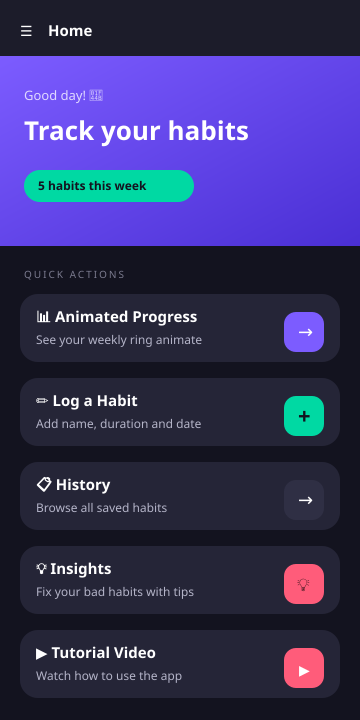
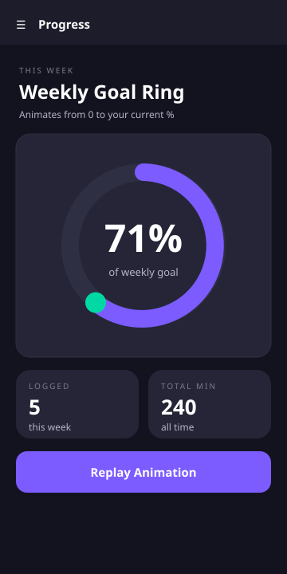
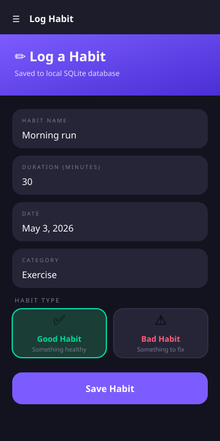
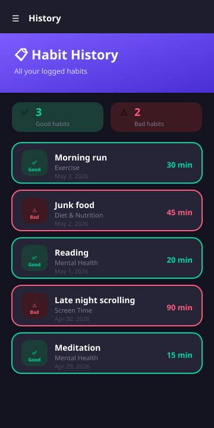
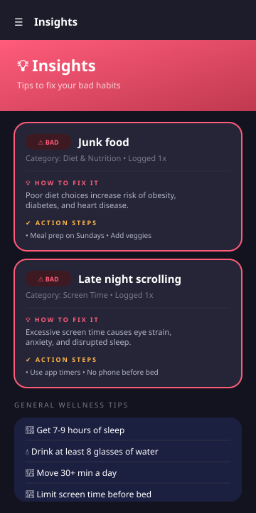
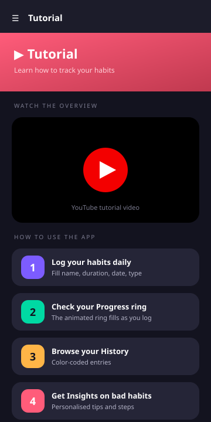

# 🔥 Habit Tracker

A cross-platform mobile app built with **.NET MAUI** for tracking daily habits, identifying bad ones, and getting personalised tips on how to fix them. Submitted for the **CS ETIC 25-Hour Certificate Project 2025-26**.

---

## 📸 Screenshots

| Home | Progress | Log Habit |
|:---:|:---:|:---:|
|  |  |  |

| History | Insights | Tutorial |
|:---:|:---:|:---:|
|  |  |  |

---

## ✨ Features

- **🏠 Home** — Hero banner with your weekly habit count plus quick-action cards.
- **📊 Animated Progress Ring** — A live, animated weekly goal ring drawn on a `GraphicsView` that fills up from 0% to your current habit completion percentage.
- **✏️ Log Habit Form** — Captures Habit Name, Duration (minutes), Date, Category, and a Good/Bad toggle. All saved to a permanent local SQLite database.
- **📋 History** — Browse every saved habit with color-coded borders (green = good, red = bad) and a summary bar showing the good/bad split.
- **💡 Insights** — Reads your bad habits and gives you category-specific tips and action steps to fix each one. Covers 10 categories (Exercise, Diet, Sleep, Screen Time, Mental Health, Smoking, Alcohol, Productivity, Social, General).
- **▶️ Tutorial** — Embedded YouTube video plus 4 step-by-step cards explaining how to use the app.

---

## ✅ Project Requirements Met

| Requirement | Where it lives |
|---|---|
| Built with .NET MAUI (Android + iOS) | `HabitTrackerApp.csproj` targets `net9.0-android` and `net9.0-ios` |
| Data-related **animated** image | `Pages/ProgressPage.xaml(.cs)` — animated ring on a `GraphicsView` |
| Form with **3 data fields** | `Pages/LogPage.xaml(.cs)` — Name, Duration, Date (+ Category and Good/Bad as bonuses) |
| **Permanent local database** | `Services/DatabaseService.cs` — SQLite via `sqlite-net-pcl` at `FileSystem.AppDataDirectory/habits.db3` |
| Browse / load saved data on a **separate page** | `Pages/HistoryPage.xaml(.cs)` — `CollectionView` |
| **Embedded video** on its own page | `Pages/TutorialPage.xaml(.cs)` — `WebView` with YouTube iframe |
| Each requirement has its own page | 6 pages: Home, Progress, Log, History, Insights, Tutorial |
| Easy navigation | Shell flyout menu + tappable cards on Home |
| Consistent color scheme | `Resources/Styles/Colors.xaml` applied across every page |

---

## 🎨 Design System

| Token | Value | Use |
|---|---|---|
| Primary | `#7C5CFF` | Buttons, headers, ring fill |
| Accent | `#00D9A3` | Highlights, good-habit indicators |
| Danger | `#FF5C7A` | Bad-habit indicators, warnings |
| BgDeep | `#13131F` | Page background |
| BgCard | `#252537` | Cards |
| TextPrimary | `#FFFFFF` | Headings |
| TextSecondary | `#B4B4C8` | Body text |

---

## 🛠 Tech Stack

- **.NET 9 MAUI** for the cross-platform UI
- **SQLite** (`sqlite-net-pcl`) for local storage
- **CommunityToolkit.Maui.MediaElement** for video playback
- **Microsoft.Maui.Graphics** (`GraphicsView` + `IDrawable`) for the animated ring
- Custom **SVG** app icon and splash screen with gradients

---

## 📁 Project Structure

```
HabitTrackerApp/
├── HabitTrackerApp.csproj    # Multi-target Android + iOS
├── MauiProgram.cs            # DI registration
├── App.xaml(.cs)             # App entry, loads global styles
├── AppShell.xaml(.cs)        # Flyout navigation
├── Models/
│   └── Habit.cs              # SQLite-mapped model
├── Services/
│   └── DatabaseService.cs    # SQLite CRUD + aggregate queries
├── Pages/
│   ├── HomePage              # Landing hub
│   ├── ProgressPage          # Animated weekly ring
│   ├── LogPage               # 3-field form, saves to SQLite
│   ├── HistoryPage           # Browse/load all entries
│   ├── InsightsPage          # Bad-habit fix tips
│   └── TutorialPage          # Embedded video + how-to cards
├── Resources/
│   ├── Styles/               # Colors.xaml + Styles.xaml
│   ├── AppIcon/              # Custom flame logo
│   └── Splash/               # Custom splash screen
└── Platforms/
    ├── Android/
    └── iOS/
```

---

## ▶️ How to Run

### Prerequisites
- **Visual Studio 2022 or 2026** with the **".NET Multi-platform App UI development"** workload
- An Android Emulator (or iOS Simulator on macOS) configured in Visual Studio

### Steps
1. Clone the repository:
   ```
   git clone https://github.com/rafihossainn/HabitTrackerAPP.git
   ```
2. Open `HabitTrackerApp.sln` in Visual Studio.
3. Wait for NuGet to restore (`Microsoft.Maui.Controls`, `sqlite-net-pcl`, `CommunityToolkit.Maui`, `CommunityToolkit.Maui.MediaElement`).
4. In the toolbar, select an Android Emulator.
5. Press **F5** to build and deploy.

---

## 📌 Notes

- **Video source**: The Tutorial page embeds a YouTube video via `WebView`. Swap the video ID in `Pages/TutorialPage.xaml.cs` to change it.
- **Database location**: `habits.db3` lives in the app's sandboxed `AppDataDirectory` so data persists across restarts.
- **Animation**: The progress ring uses `Animation` + a custom `IDrawable` on `GraphicsView`. It re-animates every time you visit the Progress page or tap **Replay Animation**.

---

## 👤 Author

Built by **Rafi Hossain** for the CS ETIC 2025-26 certificate program.
